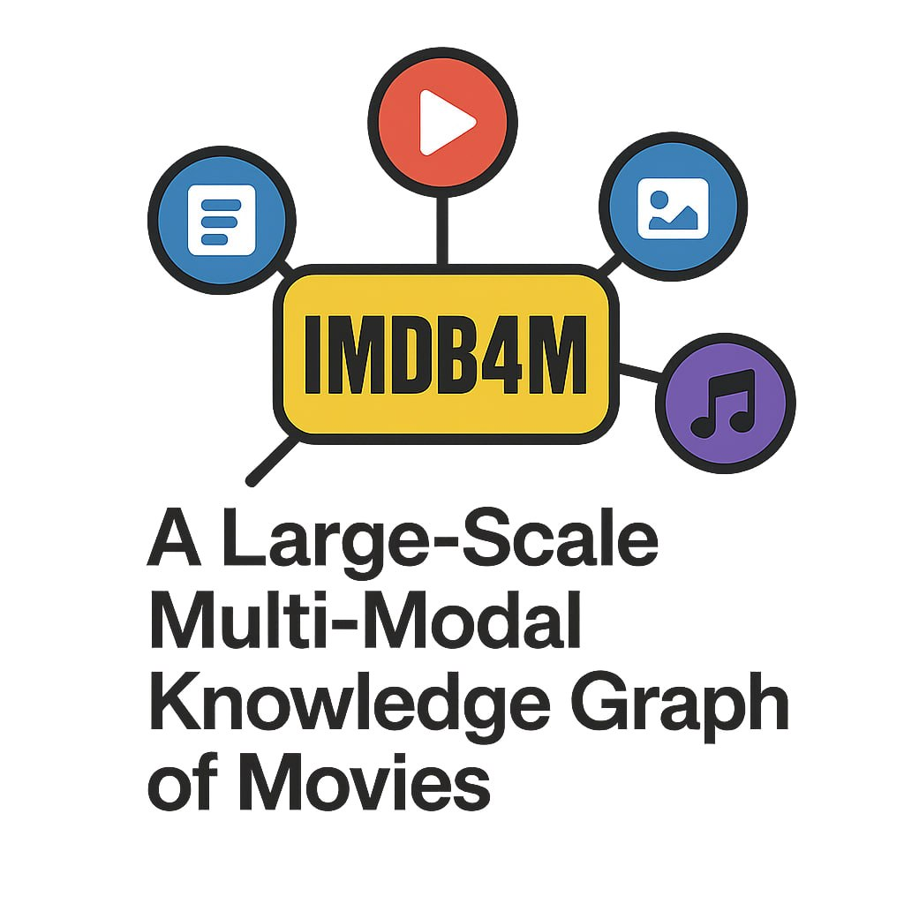

<div align="center">



# 🎬 IMDB4M

### A Large-Scale Quad-Modal Knowledge Graph of Movies

[]()
[](https://www.w3.org/TR/turtle/)
[](https://schema.org/)
[](https://creativecommons.org/licenses/by-nc/4.0/)
[]()
[](https://python.org)

<p align="center">
  <strong>A comprehensive RDF knowledge graph integrating Text, Images, Video, and Audio modalities for 376 fully-annotated movies</strong>
</p>

[Overview](#-overview) •
[Features](#-features) •
[Knowledge Graph Schema](#-knowledge-graph-schema) •
[Installation](#-installation) •
[Usage](#-usage) •
[Evaluation](#-evaluation) •
[Citation](#-citation)

</div>

---

## 📖 Overview

**IMDB4M** is a large-scale, **quad-modal** knowledge graph for the movie domain that overcomes the bimodal bottleneck of existing multimodal knowledge graphs.

IMDB4M comprehensively harmonises symbolic metadata of movies and actors and integrates them with **four distinct modalities**: text (plots, comments, reviews), images (posters, stills), video (trailers), and audio (soundtracks). Unlike prior resources often constructed with ad-hoc vocabularies, IMDB4M is engineered on **schema.org** to ensure semantic interoperability, discoverability, and structural quality.

The knowledge graph integrates:
- 🎥 **Movie Metadata**: Titles, plots, genres, ratings, release dates, budgets, revenues, production companies
- 🎭 **Cast & Crew**: 5,484 actors, directors, writers with complete filmographies using `schema:PerformanceRole`
- 🎵 **Soundtracks**: Music recordings and compositions with performers, composers, lyricists (avg. 11.2 per movie)
- 📹 **Videos**: Movie trailers with thumbnails, duration, and upload dates (99.2% coverage)
- 🖼️ **Images**: Movie stills and promotional images with captions and entity links (avg. 7.9 per movie)
- ⭐ **Reviews & Ratings**: User reviews, aggregate ratings, Metacritic scores, AI-generated summaries
- 🔗 **External Links**: Wikidata entity alignments via `owl:sameAs` mappings (78.1% artist coverage)

**Key Design Principles:**
- **Linking over Hosting**: Stores external URIs to legitimate platforms (IMDb, YouTube) rather than raw media to respect copyright
- **Schema.org Vocabulary**: Ensures semantic interoperability and Web-scale discoverability
- **First-class Multimodal Objects**: Modalities are typed semantic objects, not flat attributes

---

## ✨ Features

### 🗃️ Quad-Modal Data Integration
| Modality | Description | Schema.org Types | Properties |
|----------|-------------|------------------|------------|
| **Text** | Plots, reviews, keywords, genre | `schema:description`, `schema:Review` | 100% coverage, 48.6 avg/movie |
| **Image** | Stills, posters with captions & entity links | `schema:ImageObject` | 100% coverage, 7.9 avg/movie |
| **Video** | Trailers with thumbnails, duration, upload dates | `schema:VideoObject` | 99.2% coverage |
| **Audio** | Soundtracks with performers, composers, lyricists | `schema:MusicRecording`, `schema:MusicComposition` | 94.15% coverage, 11.2 avg/movie |

### 📊 Knowledge Graph Statistics

| Metric | Value |
|--------|-------|
| **RDF Triples** | 1,815,922 |
| **Unique Nodes** | 660,039 |
| **Unique Predicates** | 58 |
| **Seed Movies (fully annotated)** | 376 |
| **Total Movies (after expansion)** | 50,756 |
| **Artists (actors, directors, composers)** | 5,484 |
| **PerformanceRole instances** | 232,492 |
| **ImageObjects** | 36,844 |
| **Wikidata Alignments (Artists)** | 4,284 (78.1%) |
| **Entity Types** | 17 |

### 📈 Modality Coverage (Seed Movies)

| Modality | Coverage | Avg. per Movie |
|----------|----------|----------------|
| Text (plots, reviews, keywords) | 100% | 48.63 elements |
| Images (stills, posters) | 100% | 7.91 images |
| Video (trailers) | 99.2% | 0.99 videos |
| Audio (soundtracks) | 94.15% | 11.20 clips |

**93.62%** of movies possess all four modalities simultaneously.

### 🔗 External Linkage
- **Wikidata Integration**: `owl:sameAs` mappings with 78.1% coverage for artists and 100% for seed movies
- **YouTube Links**: Soundtrack-to-video linking via neuro-symbolic RAG pipeline (87.16% accuracy)

---

## 🏗️ Knowledge Graph Schema

IMDB4M uses [Schema.org](https://schema.org/) vocabulary as its primary ontology, chosen for:
1. **Coverage**: Provides primitives for movies, creative works, media objects, ratings, monetary values
2. **Expressiveness**: Rich typed representations via `schema:ImageObject`, `schema:VideoObject`, `schema:MusicRecording`
3. **Interoperability**: Widely adopted across the Web of Data, natively used by IMDb and YouTube

<div align="center">

</div>

### Schema Design Principles

- **PerformanceRole Pattern**: Actor participation uses `schema:PerformanceRole` to capture actor, movie, and `schema:characterName` together
- **N-ary Structures**: Typed blank nodes with `xsd:date`, `xsd:dateTime`, `xsd:duration`, `xsd:integer`, `xsd:decimal`
- **Two-level Audio**: `schema:MusicRecording` for performed audio, `schema:MusicComposition` for underlying work

### Key Properties

| Property | Domain | Range | Description |
|----------|--------|-------|-------------|
| `schema:actor` | Movie | PerformanceRole | Cast member with character |
| `schema:characterName` | PerformanceRole | Text | Character played by actor |
| `schema:director` | Movie | Person | Film director |
| `schema:creator` | Movie | Person | Writer/creator |
| `schema:trailer` | Movie | VideoObject | Movie trailer |
| `schema:audio` | Movie | MusicRecording | Soundtrack entry |
| `schema:image` | Movie | ImageObject | Movie still/poster |
| `schema:aggregateRating` | Movie | AggregateRating | IMDb/Metacritic score |
| `schema:review` | Movie | Review | User review |
| `schema:byArtist` | MusicRecording | Person | Performer |
| `schema:recordingOf` | MusicRecording | MusicComposition | Underlying musical work |
| `schema:composer` | MusicComposition | Person | Music composer |
| `schema:lyricist` | MusicComposition | Person | Lyrics writer |
| `schema:caption` | ImageObject | Text | Image description |
| `schema:mainEntity` | ImageObject | Person | Cast members in image |
| `schema:embedUrl` | VideoObject | URL | Trailer embed URL |
| `schema:thumbnailUrl` | VideoObject | URL | Trailer thumbnail |
| `schema:duration` | VideoObject | Duration | Video length (xsd:duration) |
| `schema:performerIn` | Person | Movie | Actor filmography |
| `owl:sameAs` | Entity | WikidataURI | External link |

---

## 📁 Repository Structure

```
imdb4m/
├── 📂 data/
│   ├── 📂 movies/                   # Movie data organized by IMDb ID
│   │   └── 📂 tt0120338/           # Example: Titanic
│   │       ├── 📂 movie_html/      # Parsed movie metadata (.ttl)
│   │       └── 📂 movie_soundtrack/ # Soundtrack metadata (.ttl, .json)
│   ├── 📂 kg/                       # Consolidated knowledge graph
│   │   ├── imdb_kg_cleaned.ttl     # Main KG file
│   │   └── sameas_mappings.ttl     # Wikidata alignments
│   └── 📂 sample/                   # Sample subset for testing
│
├── 📂 linker/                       # Music Linker module
│   ├── models.py                   # Pydantic data models
│   ├── youtube_client.py           # YouTube API integration
│   ├── gemini_matcher.py           # LLM-powered matching
│   └── music_linker.py             # Main orchestrator
│
├── 📂 extractor/                     # Data collection scripts
│   ├── download_imdb_movie.py      # Movie page extractor
│   ├── download_imdb_actor.py      # Actor page extractor
│   └── 📂 movie_seeds/             # Movie selection criteria
│
├── 📂 QA/                           # Quality assurance
│   ├── QA_gold.json                # Gold standard annotations
│   ├── qa_kg.json                  # KG-derived answers
│   └── evaluate_qa.py              # Evaluation metrics
│
├── 📜 parse_imdb_movie.py          # HTML → RDF parser (movies)
├── 📜 parse_imdb_actor.py          # HTML → RDF parser (actors)
├── 📜 parse_soundtrack_to_ttl.py   # Soundtrack → RDF parser
├── 📜 analyze_kg.py                # KG statistics & analysis
├── 📜 create_sameas_mappings.py    # Wikidata linking
└── 📜 requirements.txt             # Python dependencies
```

---

## 🔧 Construction Methodology

IMDB4M follows a four-stage pipeline:

### 1. Seeding Strategy
- Sampled **N=100 movies per decade** (1980-2020) for temporal diversity
- Resulted in **376 distinct seed movies** after deduplication
- Each seed enriched with top 20 cast, trailers, images, reviews

### 2. Recursive Expansion
- Extracted **5,484 unique artists** from seed movies
- Retrieved complete filmographies to extend neighbourhood structure
- Captured latent connections through shared collaborators

### 3. Pruning
- Removed ~69,000 leaf-node movies connected to only one artist
- Yielded refined core of **660,039 movies** and **5,484 artists**

### 4. External Linking
- **Wikidata Alignment**: Query SPARQL endpoint via IMDb ID property P345
- **YouTube Linking**: RAG pipeline with Gemini verification for soundtracks

### Data Extraction
The extraction pipeline leverages:
- **JSON-LD blocks** from IMDb pages (primary source for schema.org metadata)
- **Next.js data payloads** for deeply nested structures (credits, filmographies, reviews)
- **DOM traversal fallback** for alternate titles, budgets, gallery references

---

## 🚀 Installation

### Prerequisites
- Python 3.10 or higher
- pip package manager

### Setup

```bash
# Clone the repository
git clone https://github.com/onradio/imdb4m.git
cd imdb4m

# Create virtual environment (recommended)
python -m venv venv
source venv/bin/activate  # On Windows: venv\Scripts\activate

# Install dependencies
pip install -r requirements.txt
```

### API Keys (Optional - for Music Linker)

For soundtrack-to-YouTube linking functionality:

1. **YouTube Data API v3**: [Google Cloud Console](https://console.cloud.google.com/)
2. **Google Gemini API**: [Google AI Studio](https://aistudio.google.com/app/apikey)

```bash
# Create .env file with your keys
cp .env.template .env
# Edit .env with your API keys
```

---

## 📚 Usage

### Loading the Knowledge Graph

```python
from rdflib import Graph

# Load the main knowledge graph
g = Graph()
g.parse("data/kg/imdb_kg_cleaned.ttl", format="turtle")

print(f"Loaded {len(g)} triples")
```

### SPARQL Queries

```python
# Find all movies with their directors
query = """
PREFIX schema: <http://schema.org/>

SELECT ?movie ?title ?director ?directorName
WHERE {
    ?movie a schema:Movie ;
           schema:name ?title ;
           schema:director ?director .
    ?director schema:name ?directorName .
}
LIMIT 10
"""

for row in g.query(query):
    print(f"{row.title} - Directed by {row.directorName}")
```

### Query Videos/Trailers

```python
# Find all movies with trailers
query = """
PREFIX schema: <http://schema.org/>

SELECT ?movie ?title ?trailerName ?embedUrl ?duration
WHERE {
    ?movie a schema:Movie ;
           schema:name ?title ;
           schema:trailer ?trailer .
    ?trailer a schema:VideoObject ;
             schema:name ?trailerName ;
             schema:embedUrl ?embedUrl .
    OPTIONAL { ?trailer schema:duration ?duration }
}
LIMIT 10
"""

for row in g.query(query):
    print(f"{row.title}: {row.trailerName} - {row.embedUrl}")
```

### Parsing New Movies

```bash
# Parse a movie HTML file
python parse_imdb_movie.py path/to/movie.html -o output.ttl

# Parse soundtrack data
python parse_soundtrack_to_ttl.py path/to/soundtrack.html
```

### Neuro-Symbolic Audio Linker

The Music Linker uses a **Retrieval-Augmented Generation (RAG)** pipeline to link soundtrack entities to YouTube videos:

1. **Stage 1 - Retrieval**: Query YouTube Data API v3 using soundtrack metadata (title, artist, movie) with progressive relaxation
2. **Stage 2 - Verification**: Use Gemini 2.5 Flash as a neuro-symbolic reasoner to verify candidates and disambiguate between official releases vs covers

```python
from linker import MusicLinker, SoundtrackParser, Config

# Initialize
config = Config()
linker = MusicLinker(
    youtube_api_key=config.youtube_api_key,
    gemini_api_key=config.gemini_api_key
)

# Parse soundtrack from TTL
soundtracks = SoundtrackParser.parse_soundtrack_ttl(
    subset_root="data/sample",
    imdb_id="tt0120338"  # Titanic
)

# Find YouTube matches (87.16% accuracy)
results = linker.find_matches_batch(soundtracks)

for result in results:
    if result.best_match:
        print(f"🎵 {result.soundtrack.title}: {result.best_match.url}")
```

---

## 📊 Validation & Evaluation

IMDB4M includes a comprehensive validation framework combining SPARQL-based question answering and link verification.

### Validation Results

| Metric | Value |
|--------|-------|
| **Overall F1 Score** | 94.4% |
| **Precision** | 99.3% |
| **Recall** | 90.0% |
| **Avg. Levenshtein Similarity** | 0.993 |
| **Query Success Rate** | 99.3% |
| **YouTube Link Accuracy** | 87.16% |

### Running Evaluation

```bash
cd QA
python evaluate_qa.py
```

### 18 Competency Questions (SPARQL Queries)

| ID | Query | Coverage |
|----|-------|----------|
| Q1 | Who directed the movie? | 100% |
| Q2 | Who wrote the script? | 100% |
| Q3 | Who are the actors? | 100% |
| Q4 | What is the rating? | 100% |
| Q5 | How many ratings? | 100% |
| Q6 | What is the plot? | 100% |
| Q7 | When was it released? | 100% |
| Q8 | What is the runtime? | 100% |
| Q9 | What is the Metacritic score? | 95.2% |
| Q10 | What are the keywords? | 100% |
| Q11 | What is the budget? | 95.5% |
| Q12 | What is the trailer? | 99.2% |
| Q13 | What is the genre? | 100% |
| Q14 | What is the poster? | 100% |
| Q15 | Production companies? | 100% |
| Q16 | Alternate names? | 98.9% |
| Q17 | Content rating? | 98.4% |
| Q18 | Images and captions? | 100% |

---

## 📹 Video Representation

IMDB4M captures movie trailers as `schema:VideoObject` entities:

```turtle
<https://www.imdb.com/title/tt0120338> schema:trailer <https://www.imdb.com/video/vi1740686617> .

<https://www.imdb.com/video/vi1740686617> a schema:VideoObject ;
    schema:name "Official Trailer" ;
    schema:description "A seventeen-year-old aristocrat falls in love..." ;
    schema:duration "PT1M37S"^^xsd:duration ;
    schema:embedUrl <https://www.imdb.com/video/vi1740686617/> ;
    schema:thumbnailUrl <https://m.media-amazon.com/images/M/...jpg> ;
    schema:uploadDate "2023-01-10T18:08:38.447000+00:00"^^xsd:dateTime .
```

---

## 🎵 Soundtrack Representation

Detailed soundtrack modeling with performers, composers, and compositions:

```turtle
<https://www.imdb.com/title/tt0120338/> schema:audio [
    a schema:MusicRecording ;
    schema:name "My Heart Will Go On" ;
    schema:byArtist <https://www.imdb.com/name/nm0001144/> ;  # Céline Dion
    schema:producer <https://www.imdb.com/name/nm0000035/> ;  # James Horner
    schema:recordingOf [
        a schema:MusicComposition ;
        schema:name "My Heart Will Go On" ;
        schema:composer <https://www.imdb.com/name/nm0000035/> ;  # James Horner
        schema:lyricist <https://www.imdb.com/name/nm0421263/>   # Will Jennings
    ]
] .
```

---

## 🖼️ Image Representation

Movie stills with captions, dimensions, and entity links:

```turtle
<https://www.imdb.com/title/tt0120338/mediaviewer/rm4035688192/> a schema:ImageObject ;
    schema:caption "Leonardo DiCaprio and Kate Winslet in Titanic (1997)" ;
    schema:width 2048 ;
    schema:height 1385 ;
    schema:url <https://m.media-amazon.com/images/M/...jpg> ;
    schema:mainEntity <https://www.imdb.com/name/nm0000138/>,  # Leonardo DiCaprio
                      <https://www.imdb.com/name/nm0000701/> . # Kate Winslet
```

---

## 🔗 Wikidata Integration

IMDB4M includes `owl:sameAs` mappings to Wikidata for enhanced interoperability:

```turtle
<https://www.imdb.com/title/tt0120338> owl:sameAs <http://www.wikidata.org/entity/Q44578> .
<https://www.imdb.com/name/nm0000138> owl:sameAs <http://www.wikidata.org/entity/Q38111> .
```

Generate mappings:
```bash
python create_sameas_mappings.py
```

---

## 📈 Knowledge Graph Analysis

```bash
# Run comprehensive KG analysis
python analyze_kg.py
```

### Graph Structure Statistics

| Metric | Value |
|--------|-------|
| Connected Components | 1 (fully connected) |
| Graph Density | 5.05 × 10⁻⁵ |
| Average Degree | 5.5 |
| Leaf Nodes | 38.6% (primarily literals) |
| Sink Nodes | 45% |
| Hub Nodes (top 1%) | 6,656 |
| Max Out-Degree | 787 (prolific actor) |

### Entity Type Distribution

| Type | Count |
|------|-------|
| `schema:PerformanceRole` | 232,492 |
| `schema:Movie` | 50,756 |
| `schema:ImageObject` | 36,844 |
| `schema:Person` | 16,994 |
| Blank Nodes | 253,369 (38.4%) |

**Top Predicates** (72% of all triples): `schema:actor`, `rdf:type`, `schema:performerIn`, `schema:characterName`

---

## 🎯 Applications

IMDB4M enables research across multiple domains:

### 🎥 Movie Recommendation
- Content-based recommendation using visual style of posters and acoustic features of soundtracks
- Extract audio embeddings from linked YouTube videos
- Temporal visual features from trailers for queries like "find movies with high-paced action sequences and electronic scores"

### 🔍 Multimodal Question Answering
- Knowledge Graph Question Answering (KGQA) with perceptual grounding
- Multimodal RAG systems answering "Who is the actor shown in this scene, and what other movies have they directed?"
- Complex queries involving reified relations ("Who played character X in movie Y?")

### 🧩 Multimodal Knowledge Graph Completion
- **Link Prediction**: Infer `schema:genre` from poster and plot
- **Entity Alignment**: Cross-platform alignment via visual similarity of actor portraits
- **KG Embeddings**: Train multimodal embedding models (e.g., TransE with visual features)

---

## 🤝 Contributing

Contributions are welcome! Please feel free to submit pull requests or open issues.

1. Fork the repository
2. Create a feature branch (`git checkout -b feature/amazing-feature`)
3. Commit your changes (`git commit -m 'Add amazing feature'`)
4. Push to the branch (`git push origin feature/amazing-feature`)
5. Open a Pull Request

---

## 📜 License

This project is released under a **Creative Commons Attribution-NonCommercial (CC-BY-NC)** license to ensure alignment with IMDb's terms of use, which restrict data utilisation to academic and non-commercial settings.

IMDB4M functions strictly as a structural indexing layer rather than a media hosting platform. The resource does not store or redistribute any raw multimedia files—only external URIs that reference the original content hosted on IMDb and YouTube.

---

## 📄 Citation

If you use IMDB4M in your research, please cite:

```bibtex
@inproceedings{imdb4m2026,
  title={{IMDB4M}: A Large-Scale Multi-Modal Knowledge Graph of Movies},
  author={Reklos, Ioannis and de Berardinis, Jacopo and Simperl, Elena and Mero{\~n}o-Pe{\~n}uela, Albert},
  year={2026},
  note={Under review}
}
```

### Comparison with Related Work

| Dataset | Text | Image | Video | Audio | #Entity | #Relation |
|---------|------|-------|-------|-------|---------|-----------|
| MKG-W | 14,123 | 14,463 | – | – | 15,000 | 169 |
| MKG-Y | 12,305 | 14,244 | – | – | 15,000 | 28 |
| TIVA-KG | 11,858 | 11,636 | 10,269 | 2,441 | 11,858 | 16 |
| KVC16K | 14,822 | 14,822 | 14,822 | 14,822 | 16,015 | 4 |
| **IMDB4M** | **385,595** | **37,220** | **3,983** | **4,211** | **660,039** | **58** |

---

## 🙏 Acknowledgments

- **IMDb** for movie metadata
- **Wikidata** for entity linking
- **Schema.org** for vocabulary standards
- **YouTube Data API** for video linking
- **Google Gemini** for intelligent matching

---

<div align="center">

**[⬆ Back to Top](#-imdb4m)**

Made with ❤️ for the Semantic Web community

</div>
